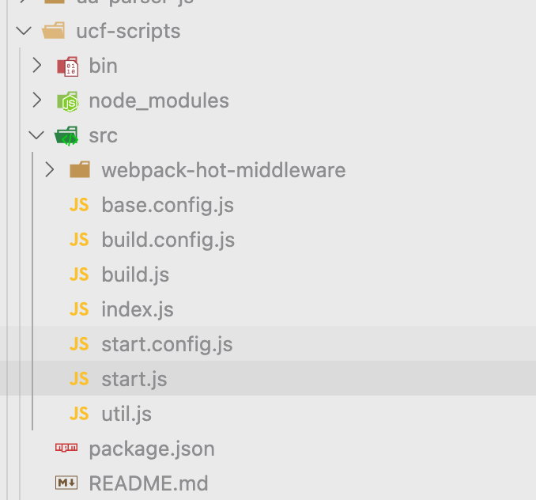
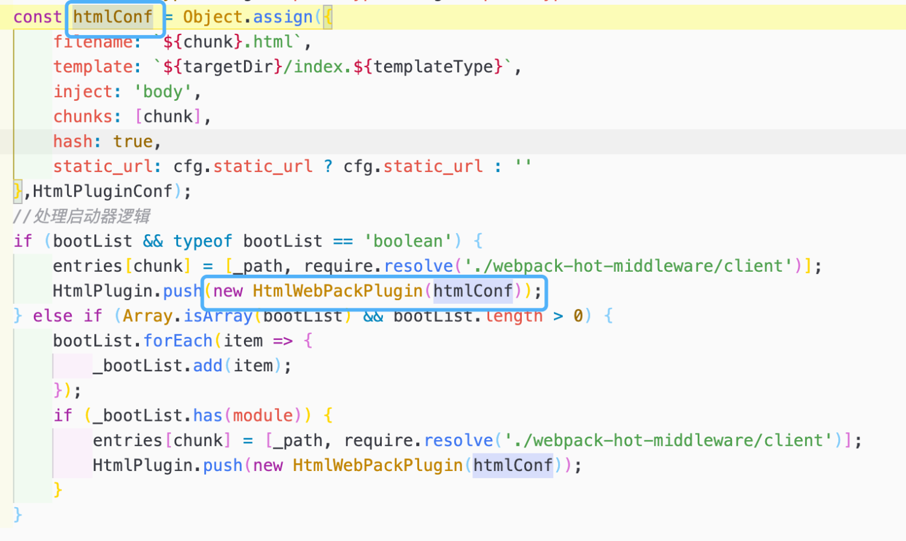
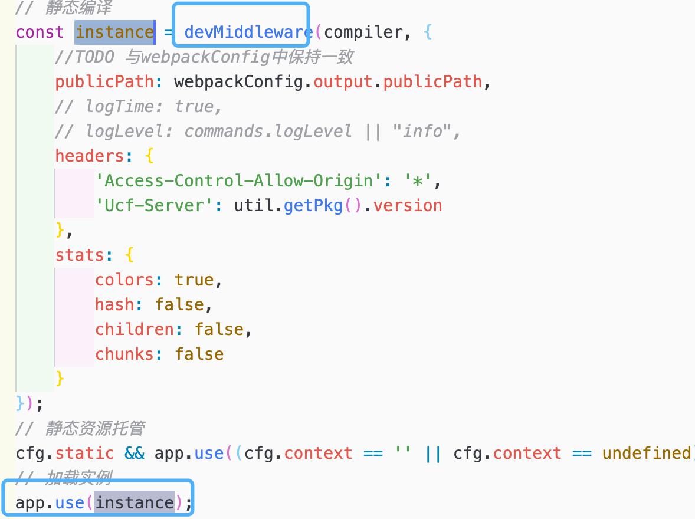
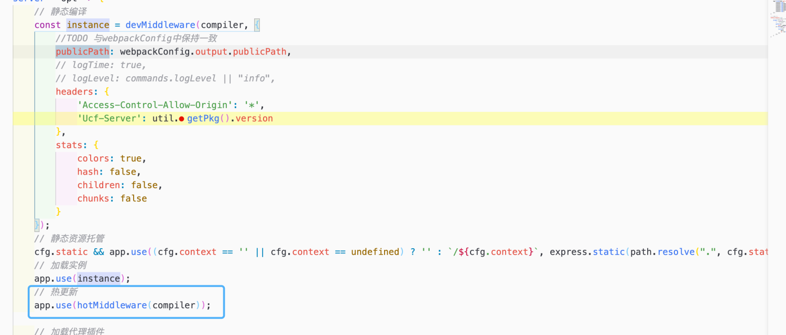

# 1. 介绍

ucf-scripts是bip平台统一的前端工程脚手架。

<!--more-->


# 2. 目录



目录文件说明

1. base.config.js 基础配置文件
1. start.js 本地起服务入口文件
1. build.js 打包服务入口文件
1. start.config.js 本地起服务配置文件
1. build.config.js 打包配置文件
1. utils.js 工具方法

# 3. Plugins插件

## 3.1 start.config.js

### 3.1.1. open-browser-plugin

项目启动后自动打开浏览器

### 3.1.2. html-webpack-plugin

html-webpack-plugin 为应用程序生成一个 HTML 文件，并自动将生成的所有 bundle 注入到此文件中。

#### 使用



- 说明
  1. filename 生成的模版文件的名字
  2. template 模版来源文件
  3. inject 引入模板的注入位置，取值有true/false/body/head 
     - true：默认值，script标签位于html文件的body底部
     - body:script标签位于html文件的body底部
     - head:script标签位于html文件的head中
     - false:不插入生成的js文件，这个几乎不会用到
  4. chunks 引入的模块，这里指定的是entry中设置多个js时，在这里指定引入的js，如果不设置则默认全部引入
  5. hash 
     - true 打包生成的html文件引入的js/css带有hash值
  6. static_url
- 困惑解析使用require.resolve函数来查询某个模块文件的带有完整绝对路径的文件名
  1. require.resolve(url)

### 3.1.3. HotModuleReplacementPlugin

热更新模块

```javascript
    plugins: [
        new webpack.HotModuleReplacementPlugin(),
        ...HtmlPlugin
    ]
```

### 3.1.4. DefinePlugin

允许在 **编译时** 将你代码中的变量替换为其他值或表达式

```javascript
//环境变量注入
cfg.global_env && (config.plugins = config.plugins.concat(new webpack.DefinePlugin(cfg.global_env)));
```

### 3.1.5. @tinper/next-plugin

统一前端三方包接入Plugin

## 3.2. base.config.js

### 3.2.1. BannerPlugin

webpack内置Plugin，在打包好的js文件最开始处添加版权声明。

```javascript
    plugins: [
        new webpack.BannerPlugin({
            banner: `File:[file] Date:${new Date()}`
        })
    ]
```

### 3.2.2. mini-css-extract-plugin

原本的状态是css-in-js，使用该插件后可以将css单独打包成一个文件。

```javascript
plugins: [
        new MiniCssExtractPlugin({
            filename: '[name].css',
            chunkFilename: '[name].css',
            ignoreOrder: true
        }),
]
```

### 3.2.3. ProgressPlugin

webpack构建进度条。

```javascript
new webpack.ProgressPlugin()
```

## 3.3 build.config.js

### 3.3.1. CleanWebpackPlugin

删除指定目录下的文件。在项目中主要用来在每一次编译前，先删除上一次编译完后的代码。

### 3.3.2. OptimizeCSSAssetsPlugin

压缩css代码

### 3.3.3. TerserWebpackPlugin

1. webpack5已内置该插件，但webpack v4并没有内置。
1. 该插件使用 [terser](https://github.com/terser/terser) 来压缩 JavaScript。

### 3.3.4. html-webpack-plugin

### 3.3.5. TNSClientPlugin

# 4. Loader

1. loader的顺序是从下往上，从右往左

## 4.1. start.config.js

### 无

## 4.2. base.config.js

### 4.2.1. babel-loader

babel-loader可以将ES6、ES7等一些浏览器不支持的高级语法编译成浏览器可以识别的ES5语法。

### 4.2.2. css-loader

对@import和url()进行处理，就像js解析import/require()一样。

### 4.2.3. postcss-loader

进一步处理css文件，比如添加浏览器前缀，压缩CSS等。

### 4.2.4. less-loader

将Less编译成css

### 4.2.5. style-loader

将css插入到dom中，但是我们一般会使用MiniCSSExtractPlugin将CSS打包成独立的css文件，并通过HtmlWebpackPlugin引入css文件，所以可以不用这个loader

### 4.2.6. url-loader

 将文件作为 data URI 内联到 bundle 中

### 4.2.7. file-loader

将文件发送到输出目录

## 4.3 build.config.js

### 无

# 5. Middleware

## 5.1 start.config.js

### 5.1.1. http-proxy-middleware

代理中间件，用于转发请求，将客户端发送的请求数据转发到目标服务器，再将响应输送到客户端。

### 5.1.2. webpack-dev-middleware

生成一个与webpack的compiler绑定的中间件，在express启动的服务app中调用这个中间件。

作用

1. 通过watch mode，监听资源的变更，自动打包
1. 快速编译，走内存 ！！！
1. 返回中间件，支持express的use格式

### 5.1.3. webpack-hot-middleware

实现页面热更新，一般与webpack-dev-middleware配合使用


# 6. 分析


**本地起服务走start.js, 编译走build.js。**
**​**

## 6.1 base.config.js

```javascript
// 基本配置
const config = {
	output: {}, 
  module: {},
  resolve: {},
  plugins: {}
}
```

### 6.1.1. output

```javascript
// 配置webpack如何输出、以及在哪里输出你的「bundle、asset 和其他你所打包或使用 webpack 载入的任何内容」。
const config = {
	output: {
        path: path.resolve('.', dist_root, _context), // 输出路径
        filename: '[name].js', // bundle名称
        chunkFilename: '[name].js', // 非初始chunk文件的名称
        publicPath: cfg.publicPath ? '/' + _context : undefined, // 在浏览器中所引用的「此输出目录对应的公开 URL」
        environment: {
            // The environment supports arrow functions ('() => { ... }').
            arrowFunction: false,
            // The environment supports BigInt as literal (123n).
            bigIntLiteral: false,
            // The environment supports const and let for variable declarations.
            const: false,
            // The environment supports destructuring ('{ a, b } = obj').
            destructuring: false,
            // The environment supports an async import() function to import EcmaScript modules.
            dynamicImport: false,
            // The environment supports 'for of' iteration ('for (const x of array) { ... }').
            forOf: false,
            // The environment supports ECMAScript Module syntax to import ECMAScript modules (import ... from '...').
            module: false,
        }
    },
}
```

### 6.1.2. module

1. 使用相对应的loader对js/less/css/图片/图标字体/svg等做处理编译

### 6.1.3. resolve

```javascript
const config = {
	resolve: {
    		// 尝试按顺序解析这些后缀名。如果有多个文件有相同的名字，但后缀名不同，webpack 会解析列在数组首位的后缀的文件 并跳过其余的后缀。
        extensions: [
            ".jsx", ".js", ".less", ".css", ".json"
        ],
    
    		// 别名配置
        alias: {
            'ucf-apps': path.resolve('.', 'ucf-apps/'),
            'ucf-common': path.resolve('.', 'ucf-common/src/'),
            components: path.resolve('.', 'ucf-common/src/components/'),
            static: path.resolve('.', 'ucf-common/src/static/'),
            utils: path.resolve('.', 'ucf-common/src/utils/')
        }
   },
}

```

### 6.1.4. plugins

```javascript
const config = {
    plugins: [
        new webpack.BannerPlugin({
            banner: `File:[file] Date:${new Date()}`
        }),
        new MiniCssExtractPlugin({
            filename: '[name].css',
            chunkFilename: '[name].css',
            ignoreOrder: true
        }),
        new webpack.ProgressPlugin()
    ]
}
```

## 6.2 start.js

1. 本地起服务的时候，调用server方法，并传入{port, ip}

```javascript
const getPort = require('get-port');
const ip = require('ip');

() => {
        // 设置默认端口
        // 检测是否被占用，更换端口，启动调试服务
        getPort({
            port: commands.port || 3000
        }).then(port => {
            // 启动服务
            server({
                port,
                ip: ip.address()
            });
        });
  }
```

2. server方法定义如下

```javascript
const webpackConfig = require('./start.config');
const compiler = webpack(webpackConfig);

server = opt => {
    // 使用webpack-dev-middleware生成一个和webpack的compiler绑定的中间件
    const instance = devMiddleware(compiler, {
        publicPath: webpackConfig.output.publicPath,
        headers: {
            'Access-Control-Allow-Origin': '*',
            'Ucf-Server': util.getPkg().version
        },
        stats: {
            colors: true,
            hash: false,
            children: false,
            chunks: false
        }
    });
  
    // 静态资源托管
    cfg.static && app.use((cfg.context == '' || cfg.context == undefined) ? '' : `/${cfg.context}`, express.static(path.resolve(".", cfg.static)));
    // 加载实例
    app.use(instance);
    // 热更新
    app.use(hotMiddleware(compiler));

    // 加载代理插件
    // 处理proxy数组情况
    cfg.proxy && cfg.proxy.forEach(function (element) {
        if (element.enable) {// 代理开启
            // 默认配置项
            let proxyOpt = {
                target: element.url,
                logLevel: "debug",
                changeOrigin: true,
                pathRewrite: Object.assign({}, element.pathRewrite),
                headers: (typeof element.headers !== 'undefined' ? element.headers : {}),
                onProxyRes: function (proxyRes) {
                    proxyRes.headers["Ucf-Proxy"] = "success";
                }
            }
            app.use(element.router, createProxyMiddleware(element.opts || proxyOpt));
        }
    });
    // 运行调试服务
    app.listen(opt.port, host, () => {
        console.log();
        console.log(chalk.green(`----------------------------------------------------`));
        console.log(chalk.yellow(`\t 🚀 UCF Develop Server`));
        console.log(chalk.green(`\t [Server Version]: 🏅 ${util.getPkg().version}`));
        console.log(chalk.green(`\t [Local]         : 🏠 http://${browserHost}:${opt.port}`));
        console.log(chalk.green(`\t [Lan]           : 📡 http://${opt.ip}:${opt.port}`));
        console.log(chalk.green(`----------------------------------------------------`));
        console.log();
    });
}
```

## 6.3 start.config.js

1. 大致的配置，会与base.config.js合并。

```javascript
const base = require('./base.config');
//默认的配置用于merge操作
const config = {
    devtool: 'source-map',
    mode: 'development',
    externals: cfg.externals, // 构建排除指定包
    resolve: { 
        alias: cfg.alias // 别名配置
    },
    module: {
        rules: cfg.loader // loader配置
    },
    plugins: [
        new webpack.HotModuleReplacementPlugin(), // 热更新Plugin
        ...HtmlPlugin // 查看第2点
    ]
}
//入口
config.entry = entries;

//环境变量注入
cfg.global_env && (config.plugins = config.plugins.concat(new webpack.DefinePlugin(cfg.global_env)));
//传入插件设置
cfg.devPlugins && (config.plugins = config.plugins.concat(cfg.devPlugins));
module.exports = merge(base, config);
```

2. HtmlPlugin的相关配置

```javascript
const HtmlPlugin = [];

// 判断是否加载默认页面打开浏览器
if (commands.homepage) {
    HtmlPlugin.push(new OpenBrowserPlugin({
        url: `http://${browserHost}:${commands.port || 3000}/${commands.homepage || ''}`
    }));
}


//加载本地开发环境的Portal
glob.sync('./ucf-common/src/portal/src/app.js').forEach(_path => {
    entries['index'] = './ucf-common/src/portal/src/app.js';
    const htmlConf = {
        filename: `index.html`,
        template: './ucf-common/src/portal/src/index.html',
        inject: 'body',
        chunks: ['index'],
        hash: true
    };
    HtmlPlugin.push(new HtmlWebPackPlugin(htmlConf));
});

//构造模块加载入口以及html出口
bootFiles.forEach(_path => {
  
  	// 获取上下文
    let _context = "";
    if (!cfg.publicPath && cfg.context) {
        _context = `${cfg.context}/`;
    }
    //模块名
    const module = _path.split(`./${scan_root}/`)[1].split(`/src/${bootName}`)[0];

    const chunk = `${_context}${module}/index`; // 拼接结果'iuap-mdm-ucf/association/index'
    const targetDir = _path.split(`/${bootName}`)[0]

    // 兼容其他类型的模版配置，如：ejs
    const templateType = cfg.templateType ? cfg.templateType : 'html'
    
    const htmlConf = Object.assign({
        filename: `${chunk}.html`,
        template: `${targetDir}/index.${templateType}`,
        inject: 'body',
        chunks: [chunk],
        hash: true,
        static_url: cfg.static_url ? cfg.static_url : '' 
    },HtmlPluginConf);
  
    //处理启动器逻辑
    if (bootList && typeof bootList == 'boolean') {
        entries[chunk] = [_path, require.resolve('./webpack-hot-middleware/client')];
        HtmlPlugin.push(new HtmlWebPackPlugin(htmlConf));
    } else if (Array.isArray(bootList) && bootList.length > 0) { // 多入口
        bootList.forEach(item => {
            _bootList.add(item);
        });
        if (_bootList.has(module)) {
            entries[chunk] = [_path, require.resolve('./webpack-hot-middleware/client')];
            HtmlPlugin.push(new HtmlWebPackPlugin(htmlConf));
        }
    }
});

// 统一前端三方包接入TNS
if (tnsEnabled) {
    HtmlPlugin.push(new TNSClientPlugin({libraryDebug: true, ...tnsDetailCfg}));
}
```

## 6.4 build.js

```javascript
const webpackConfig = require('./build.config');
const compiler = webpack(webpackConfig);

//启动构建
module.exports = {
    plugin: () => {
        build();
    }
}

// 调用build方法
build = () => {
    console.log();
    console.log(chalk.green(`--------------------------------------------`));
    console.log(chalk.yellow(`\t 🚀  UCF Build Server`));
    console.log(chalk.green(`\t [Build Version] : 🏅 ${util.getPkg().version}`));
    console.log();
    console.log(chalk.green(`\t 💪 Good Luck Please Wait ☃️`));
    console.log(chalk.green(`--------------------------------------------`));
    console.log();
    compiler.run((err, stats) => {
        if (!err) {
            console.log('\n' + stats.toString({
                hash: false,
                chunks: false,
                children: false,
                colors: true
            }));
        } else {
            console.log(chalk.red(err));
        }
    });
}
```

## 6.5. build.config.js

1. 大致的配置，会与base.config.js

```javascript
const config = {
    output,
    mode: 'production',
    devtool: 'cheap-module-source-map',
    externals: cfg.externals,
    resolve: {
        alias: cfg.alias
    },
    module: {
        rules: cfg.loader
    },
    optimization: {
        // 不使用内部压缩参数关闭
        minimize: false
    },
    plugins: [
        new CleanWebpackPlugin(),
        new OptimizeCSSAssetsPlugin({
            cssProcessorOptions: {
                safe: true,
                mergeLonghand: false,
                discardComments: { removeAll: true }
            },
            canPrint: true
        }),
        new TerserPlugin({
            // test: /\.js(\?.*)?$/i,
            // cache: true,
            parallel: true,
            // sourceMap: cfg.open_source_map == undefined ? true : cfg.open_source_map
            // include:'vendor',
            // exclude:'vendor',
        }),
        ...HtmlPlugin // 查看2点
    ]
}

// 入口
config.entry = entries;

// 环境变量注入
cfg.global_env && (config.plugins = config.plugins.concat(new webpack.DefinePlugin(cfg.global_env)));
// 传入插件设置
cfg.buildPlugins && (config.plugins = config.plugins.concat(cfg.buildPlugins));
// 是否启用优化资源单独生成文件
cfg.res_extra && (cfg.splitChunks ? config.optimization['splitChunks'] = cfg.splitChunks : config.optimization['splitChunks'] = splitChunks);
module.exports = merge(base, config);
```

2. HtmlPlugin

```javascript
const HtmlPlugin = [];

bootFiles.forEach(_path => {
    //模块名
    const module = _path.split(`./${scan_root}/`)[1].split(`/src/${bootName}`)[0];
    const chunk = `${module}/index`;
  
    const targetDir = _path.split(`/${bootName}`)[0]
    // 兼容其他类型的模版配置，如：ejs
    const templateType = cfg.templateType ? cfg.templateType : 'html'
    
    const htmlConf = Object.assign({
        filename: `${chunk}.html`,
        template: `${targetDir}/index.${templateType}`,
        inject: 'body',
        chunks: ['vendor', chunk],
        hash: true,
        static_url: cfg.static_url ? cfg.static_url : '' 
        },HtmlPluginConf) ;
        
    //处理启动器逻辑
    if (bootList && typeof bootList == 'boolean') {
        entries[chunk] = _path;
        HtmlPlugin.push(new HtmlWebPackPlugin(htmlConf));
    } else if (Array.isArray(bootList) && bootList.length > 0) {
        bootList.forEach(item => {
            _bootList.add(item);
        });
        if (_bootList.has(module)) {
            entries[chunk] = _path;
            HtmlPlugin.push(new HtmlWebPackPlugin(htmlConf));
        }
    }
});

if (tnsEnabled) {
    HtmlPlugin.push(new TNSClientPlugin({excludeModules}));
}
```

3. 其他配置

```javascript
// output输出的文件添加hash值实现缓存
const output = cfg.hasHash ? {
    ...base.output,
    filename: '[name].[hash].js',
    chunkFilename: '[name].[hash].js',
} : base.output;


// splitChunks进行代码分离，避免加载重复代码
let splitChunks = {
    cacheGroups: {
        default: {
            minChunks: 2,
            priority: -20,
            reuseExistingChunk: true,
        },
        //打包重复出现的代码
        vendor: {
            chunks: 'initial',
            minChunks: 2,
            maxInitialRequests: 5, // The default limit is too small to showcase the effect
            minSize: 0, // This is example is too small to create commons chunks
            name: 'vendor'
        },
        //打包第三方类库
        commons: {
            name: 'vendor',
            chunks: 'initial',
            minChunks: Infinity
        }
    }
}
```

## 6.6 start.config.js与build.config.js差异

### 6.6.1. start.config.js

- 使用HotModuleReplacementPlugin热更新模块
- 使用open-browser-plugin本地起服务时自动打开指定页面

### 6.6.2. build.cofig.js

- 使用CleanWebpackPlugin在每一次构建前清除指定目录文件 
- 使用OptimizeCSSAssetsPlugin压缩CSS代码 
- 使用TerserWebpackPlugin压缩JS代码

### 